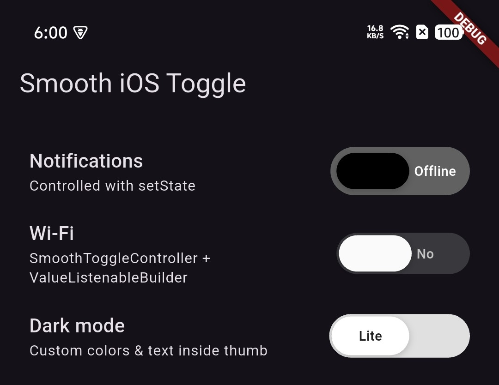
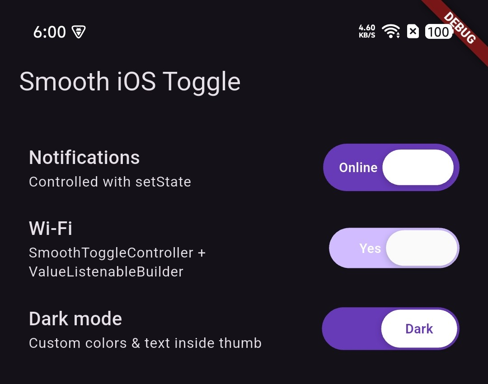

# smooth_ios_style_toggle

[](https://pub.dev/packages/smooth_ios_style_toggle)
[](https://opensource.org/licenses/MIT)

A smooth, fully customizable **iOS-style toggle** for Flutter.

- Pill thumb with **fully rounded ends** and **width = 2 × height**
- **Custom labels** beside the thumb (or inside the thumb)
- Tap, drag, keyboard, semantics, and optional haptics
- **Zero extra state-management dependencies** — uses `ValueNotifier`, `InheritedWidget`, and `setState`

## Screenshots

| Track labels (On)                         | Track labels (Off)                                        | 
| ------------------------------------------------------- | ----------------------------------------------------- |
|  |  

> Images are bundled in this package under `doc/screenshots/` and display on pub.dev automatically.

## Features

| Feature       | Description                                                                |
| ------------- | -------------------------------------------------------------------------- |
| Pill thumb    | `borderRadius = height / 2`, width always **2×** height                    |
| Inline text   | `activeText` / `inactiveText` beside the thumb, or `textInsideThumb: true` |
| Gestures      | Tap and horizontal drag with snap animation                                |
| Accessibility | Semantics, focus, Enter / Space to toggle                                  |
| Haptics       | Optional `hapticFeedback` on iOS & Android                                 |
| Theming       | Per-widget `SmoothToggleStyle` or app-wide `SmoothToggleTheme`             |
| Controller    | `SmoothToggleController` extends `ValueNotifier<bool>`                     |
| Platforms     | Android, iOS, Web, Windows, macOS, Linux                                   |

## Installation

```yaml
dependencies:
  smooth_ios_style_toggle: ^0.1.0
```

```bash
flutter pub get
```

## Quick start

```dart
import 'package:smooth_ios_style_toggle/smooth_ios_style_toggle.dart';

bool isOn = false;

SmoothIOSToggle(
  value: isOn,
  activeText: 'ON',
  inactiveText: 'OFF',
  onChanged: (value) => setState(() => isOn = value),
)
```

## Usage examples

### 1. Controlled with `setState` (like the example app)

```dart
SmoothIOSToggle(
  value: _notifications,
  activeText: 'Online',
  inactiveText: 'Offline',
  hapticFeedback: true,
  onChanged: (v) => setState(() => _notifications = v),
  onToggle: () => debugPrint('Toggled!'),
  style: SmoothToggleStyle(
    trackWidth: 115,
    trackHeight: 40,
    trackPadding: 5,
    activeTrackColor: Colors.deepPurple,
    inactiveTrackColor: Colors.grey.shade700,
    activeThumbColor: Colors.white,
    inactiveThumbColor: Colors.black,
    activeTextColor: Colors.white,
    inactiveTextColor: Colors.white,
  ),
)
```

### 2. `SmoothToggleController` + `ValueListenableBuilder`

No Provider, Riverpod, or Bloc required.

```dart
final controller = SmoothToggleController(value: true);

ValueListenableBuilder<bool>(
  valueListenable: controller,
  builder: (context, value, _) {
    return SmoothIOSToggle(
      value: value,
      controller: controller,
      activeText: 'Yes',
      inactiveText: 'No',
      onChanged: (v) => controller.value = v,
    );
  },
);

// Elsewhere in your app:
controller.toggle();
```

### 3. Text inside the thumb

```dart
SmoothIOSToggle(
  value: _darkMode,
  textInsideThumb: true,
  activeText: 'Dark',
  inactiveText: 'Lite',
  onChanged: (v) => setState(() => _darkMode = v),
  style: SmoothToggleStyle(
    trackWidth: 116,
    trackHeight: 36,
    activeTrackColor: Colors.deepPurple,
    inactiveTrackColor: Colors.grey.shade300,
  ),
)
```

### 4. App-wide defaults with `SmoothToggleTheme`

```dart
SmoothToggleTheme(
  data: const SmoothToggleStyle(
    trackHeight: 34,
    trackWidth: 110,
    animationDuration: Duration(milliseconds: 240),
  ),
  child: MaterialApp(/* ... */),
)
```

## API overview

### `SmoothIOSToggle`

| Parameter                     | Type                      | Description                                           |
| ----------------------------- | ------------------------- | ----------------------------------------------------- |
| `value`                       | `bool`                    | Current on/off state (**required**)                   |
| `onChanged`                   | `ValueChanged<bool>?`     | Called when user toggles; `null` disables interaction |
| `controller`                  | `SmoothToggleController?` | Optional `ValueNotifier` for imperative updates       |
| `activeText` / `inactiveText` | `String?`                 | Labels (default `ON` / `OFF`)                         |
| `style`                       | `SmoothToggleStyle?`      | Colors, sizes, animation, shadows                     |
| `textInsideThumb`             | `bool`                    | Render labels inside the pill thumb                   |
| `showText`                    | `bool`                    | Show or hide all labels                               |
| `hapticFeedback`              | `bool`                    | Light impact on mobile when toggled                   |
| `enabled`                     | `bool`                    | Visual disabled state                                 |
| `onToggle`                    | `VoidCallback?`           | Extra callback after each toggle                      |

### `SmoothToggleStyle`

| Property            | Default          | Description                                         |
| ------------------- | ---------------- | --------------------------------------------------- |
| `trackHeight`       | `31`             | Outer track height                                  |
| `trackWidth`        | `110`            | Outer track width (increase when using long labels) |
| `trackPadding`      | `2`              | Inset around the thumb                              |
| `animationDuration` | `220ms`          | Toggle animation length                             |
| `animationCurve`    | `easeInOutCubic` | Animation curve                                     |

Thumb dimensions are derived automatically: **thumb height = trackHeight − 2×padding**, **thumb width = 2 × thumb height**.

## Example project

```bash
cd example
flutter run
```

## Regenerate README screenshots

```bash
flutter test --update-goldens test/screenshot_golden_test.dart
```

## Requirements

- Dart SDK `>=3.0.0 <4.0.0`
- Flutter `>=3.16.0`

This repo pins Flutter **3.29.3** via [FVM](https://fvm.app) (see `.fvm/fvm_config.json`). From the project root:

```bash
fvm install
fvm use 3.29.3
cd example && fvm flutter run
```

If you see a build error about `elevation` in `semantics.dart`, see [TOOLING.md](TOOLING.md) (mixed Flutter SDK paths).

## License

MIT — see [LICENSE](LICENSE).
