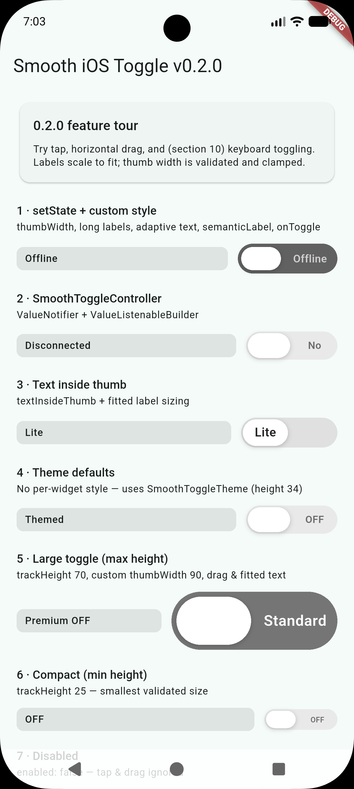
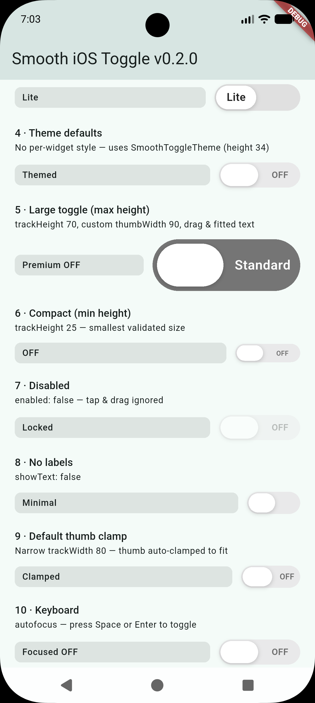
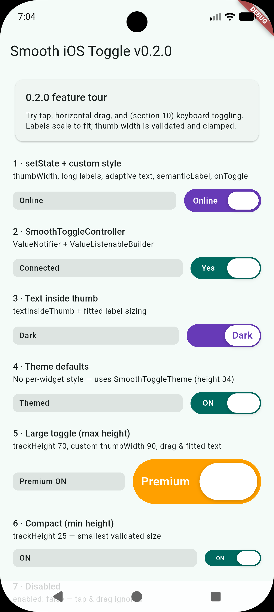
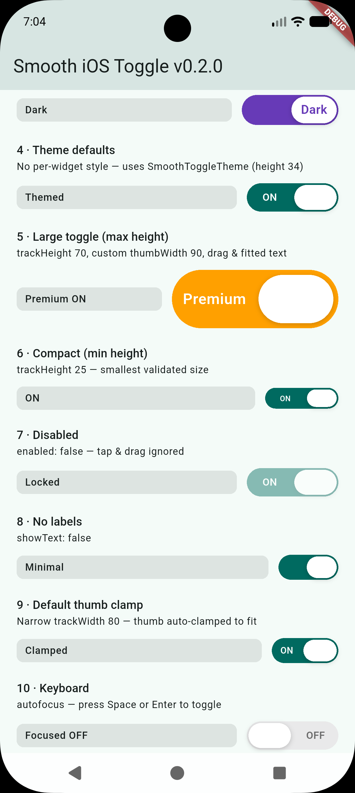

# smooth_ios_style_toggle

[](https://pub.dev/packages/smooth_ios_style_toggle)
[](https://opensource.org/licenses/MIT)

A smooth, fully customizable **iOS-style toggle** for Flutter.

- Pill thumb with **fully rounded ends** and width **~1.7× height** (auto-clamped to fit the track)
- **Custom labels** beside the thumb or **inside** the thumb — with **auto-sized, fitted text**
- Tap, drag, keyboard, semantics, and optional haptics
- **Validated sizing** for track, padding, and thumb width (debug asserts)
- **Zero extra state-management dependencies** — uses `ValueNotifier`, `InheritedWidget`, and `setState`

## Screenshots

Example app demo (scroll the list to see all toggles). **Two captures per state** — OFF and ON — because the screen shows many toggles at once (labels beside the thumb and inside the thumb appear in different rows).

| Demo — OFF (scroll 1) | Demo — OFF (scroll 2) |
| --- | --- |
|  |  |

| Demo — ON (scroll 1) | Demo — ON (scroll 2) |
| --- | --- |
|  |  |

> Add these four PNGs under [`doc/screenshots/`](doc/screenshots/README.md). They ship with the package and render on pub.dev.

## What's new in 0.2.0

- **`thumbWidth`** — optional custom thumb width with validation (`trackWidth / 4` … `trackWidth / 2`)
- **Adaptive text** — label font size scales with track/thumb; long text shrinks via `FittedBox`
- **Safer defaults** — `trackHeight` default **30**, thumb clamped to half the track width
- **Bug fixes** — no double-toggle after drag; parent `setState` / GetX animation stays in sync
- **21 tests** — tap, drag, keyboard, theme, disabled state, and style validation

See [CHANGELOG.md](CHANGELOG.md) for the full list.

## Features

| Feature       | Description                                                                |
| ------------- | -------------------------------------------------------------------------- |
| Pill thumb    | `borderRadius = height / 2`, width **~1.7×** height (clamped to track)     |
| Inline text   | `activeText` / `inactiveText` beside the thumb, or `textInsideThumb: true` |
| Adaptive text | Auto font sizing + scale-to-fit for long labels                            |
| Gestures      | Tap and horizontal drag with snap; drag cancel restores position           |
| Accessibility | `semanticLabel`, semantics `toggled`, focus, Enter / Space               |
| Haptics       | Optional `hapticFeedback` on iOS & Android                                 |
| Theming       | Per-widget `SmoothToggleStyle` or app-wide `SmoothToggleTheme`             |
| Controller    | `SmoothToggleController` extends `ValueNotifier<bool>`                   |
| Platforms     | Android, iOS, Web, Windows, macOS, Linux                                   |

## Installation

```yaml
dependencies:
  smooth_ios_style_toggle: ^0.2.0
```

```bash
flutter pub get
```

## Quick start

```dart
import 'package:smooth_ios_style_toggle/smooth_ios_style_toggle.dart';

bool isOn = false;

SmoothIOSToggle(
  value: isOn,
  activeText: 'ON',
  inactiveText: 'OFF',
  onChanged: (value) => setState(() => isOn = value),
)
```

## Usage examples

### 1. Controlled with `setState` (GetX, Riverpod, Bloc, etc.)

Works cleanly with parent-owned state — the thumb animates after your rebuild.

```dart
SmoothIOSToggle(
  value: _notifications,
  activeText: 'Online',
  inactiveText: 'Offline',
  hapticFeedback: true,
  onChanged: (v) => setState(() => _notifications = v),
  onToggle: () => debugPrint('Toggled!'),
  style: SmoothToggleStyle(
    trackWidth: 120,
    trackHeight: 36,
    thumbWidth: 48,
    trackPadding: 4,
    activeTrackColor: Colors.deepPurple,
    inactiveTrackColor: Colors.grey.shade700,
    activeTextColor: Colors.white,
    inactiveTextColor: Colors.white70,
    semanticLabel: 'Notifications',
  ),
)
```

### 2. `SmoothToggleController` + `ValueListenableBuilder`

No extra state packages required. When using a controller, **`controller.value` is the source of truth** (the `value` prop should stay in sync).

```dart
final controller = SmoothToggleController(value: true);

ValueListenableBuilder<bool>(
  valueListenable: controller,
  builder: (context, value, _) {
    return SmoothIOSToggle(
      value: value,
      controller: controller,
      activeText: 'Yes',
      inactiveText: 'No',
      onChanged: (v) => controller.value = v,
    );
  },
);

// Elsewhere:
controller.toggle();
```

### 3. Text inside the thumb

Labels scale down to fit inside the pill.

```dart
SmoothIOSToggle(
  value: _darkMode,
  textInsideThumb: true,
  activeText: 'Dark',
  inactiveText: 'Lite',
  onChanged: (v) => setState(() => _darkMode = v),
  style: const SmoothToggleStyle(
    trackWidth: 116,
    trackHeight: 36,
    activeTrackColor: Colors.deepPurple,
    inactiveTrackColor: Color(0xFFE0E0E0),
  ),
)
```

### 4. App-wide defaults with `SmoothToggleTheme`

Wrap your app (or a subtree). Per-widget `style`, when provided, **replaces** the theme for that toggle (it is not deep-merged).

```dart
SmoothToggleTheme(
  data: const SmoothToggleStyle(
    trackHeight: 34,
    trackWidth: 110,
    animationDuration: Duration(milliseconds: 240),
  ),
  child: MaterialApp(/* ... */),
)
```

### 5. Custom thumb width

```dart
const SmoothToggleStyle(
  trackWidth: 100,
  thumbWidth: 40, // must be between 25 and 50 for trackWidth 100
)
```

## API overview

### `SmoothIOSToggle`

| Parameter                     | Type                      | Description                                           |
| ----------------------------- | ------------------------- | ----------------------------------------------------- |
| `value`                       | `bool`                    | Current on/off state (**required**)                   |
| `onChanged`                   | `ValueChanged<bool>?`     | Parent callback; omit only for internal/demo state    |
| `controller`                  | `SmoothToggleController?` | Optional `ValueNotifier`; takes priority over `value` |
| `activeText` / `inactiveText` | `String?`                 | Labels (default `ON` / `OFF`)                         |
| `style`                       | `SmoothToggleStyle?`      | Colors, sizes, animation, shadows, `semanticLabel`    |
| `textInsideThumb`             | `bool`                    | Render labels inside the pill thumb                   |
| `showText`                    | `bool`                    | Show or hide all labels                               |
| `hapticFeedback`              | `bool`                    | Haptic on mobile when toggled (default `true`)        |
| `enabled`                     | `bool`                    | When `false`, ignores input (dimmed)                  |
| `onToggle`                    | `VoidCallback?`           | Extra callback after each toggle                      |
| `focusNode` / `autofocus`     |                           | Keyboard focus (Enter / Space toggles)                |

### `SmoothToggleStyle`

| Property            | Default              | Valid range / notes                              |
| ------------------- | -------------------- | ------------------------------------------------ |
| `trackHeight`       | `30`                 | **25 – 70**                                      |
| `trackWidth`        | `110`                | Increase for long beside-thumb labels            |
| `trackPadding`      | `2`                  | ≥ 0; must leave ≥ 8 px thumb height              |
| `thumbWidth`        | `null` → ~1.7× height | **trackWidth / 4 … trackWidth / 2** (if set)    |
| `animationDuration` | `200ms`              | Toggle animation length                          |
| `animationCurve`    | `easeInOut`          | Animation curve                                  |
| `semanticLabel`     | `null`               | Spoken name for screen readers (not visible)     |
| `activeTextStyle`   | auto-sized           | Merged over computed label style                 |
| `inactiveTextStyle` | auto-sized           | Merged over computed label style                 |

**Thumb dimensions (automatic)**

- **Thumb height** = `trackHeight − 2 × trackPadding`
- **Thumb width** = `thumbWidth` if set, else **~1.7 × thumb height**, clamped to **¼…½** of `trackWidth`

**Layout constants** (for advanced use): `SmoothToggleStyle.minTrackHeight`, `maxTrackHeight`, `defaultTrackPadding`, `minThumbHeight`, etc.

**Validation:** constructor asserts run in **debug** builds only; release builds still apply thumb width clamping.

## Example project

```bash
cd example
flutter run
```

## Requirements

- Dart SDK `>=3.0.0 <4.0.0`
- Flutter `>=3.16.0`

This repo pins Flutter **3.29.3** via [FVM](https://fvm.app) (see `.fvm/fvm_config.json`). From the project root:

```bash
fvm install
fvm use 3.29.3
cd example && fvm flutter run
```

If you see a build error about `elevation` in `semantics.dart`, see [TOOLING.md](TOOLING.md) (mixed Flutter SDK paths).

## License

MIT — see [LICENSE](LICENSE).
